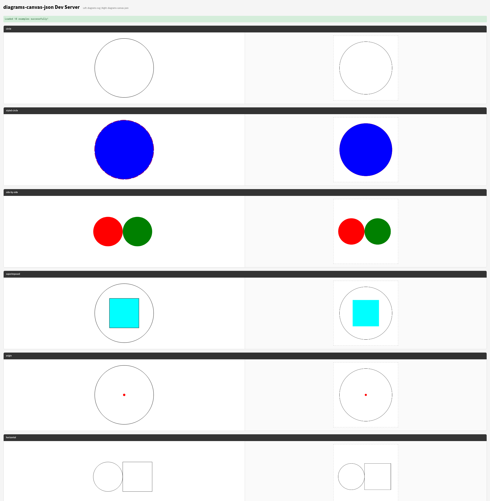

# diagrams-canvas-json

A [`diagrams`][diagrams] back-end that encodes drawings as JSON to be rendered in a browser using the Canvas API or WebGL via [PixiJS][pixijs].

[diagrams]: https://hackage.haskell.org/package/diagrams
[pixijs]: https://pixijs.com/

## AI Disclaimer

This project was generated using the AI coding agent Claude Code.

## Why

This does not cover all of `diagrams`'s features but just enough for my purposes which is mostly rendering PCB Gerber files
in several different ways in the browser.

## Project Structure

```
diagrams-canvas-json/
├── diagrams-canvas-json/          # Haskell library (diagrams backend)
│   ├── src/
│   └── diagrams-canvas-json.cabal
├── diagrams-canvas-json-cairo/    # Haskell lib + exe: render JSON to PNG/SVG/JPEG via cairo
│   ├── src/
│   ├── exe/
│   └── diagrams-canvas-json-cairo.cabal
├── diagrams-canvas-json-dev/      # Haskell exe: dev web server for examples
│   ├── exe/
│   └── diagrams-canvas-json-dev.cabal
├── diagrams-canvas-json-viewer/   # Haskell exe: browser viewer for pre-rendered JSON
│   ├── exe/
│   └── diagrams-canvas-json-viewer.cabal
├── diagrams-canvas-json-web/      # TypeScript/Canvas rendering library
│   ├── src/lib/                   # Library source (canvas renderer + viewer)
│   └── dev/                       # Development frontend
├── gerber-diagrams-canvas-json/   # Gerber PCB artwork to canvas JSON
│   ├── src/                       # Library source (gerber rendering + compositing)
│   ├── exe/                       # CLI tool (to-json, board-to-json, layers-to-json, …)
│   ├── data/                      # Test gerber and SVG reference data
│   └── gerber-diagrams-canvas-json.cabal
├── cabal.project                  # Cabal project config
└── flake.nix                      # Nix flake for development environment
```

## Packages

### diagrams-canvas-json (Haskell library)

A diagrams backend that renders to compact JSON command arrays for Canvas execution. Features:

- **Coordinate-space vs view-relative line widths**: `K`/`KS` commands scale with the diagram transform (for gerber
  traces, local/global measures); `KV`/`KSV` commands maintain constant visual width regardless of zoom (for
  normalized/output measures like `veryThick`, `thin`, etc.)
- **Independent dash pattern modes**: `LD` (coordinate-space) and `LDV` (view-relative), classified separately from line
  width
- **Fill/stroke separation**: Only closed paths are filled; stroke is skipped when lineWidth=0; alpha is multiplied by
  fill/stroke opacity attributes
- **Command optimization**: Consecutive Save/Restore groups sharing the same context are collapsed into set-only
  commands (`FS`, `KS`, `KSV`); transparent fills and strokes are stripped
- **Configurable JSON precision**: Per-category decimal place control (coordinates, alpha, transforms, line widths,
  dashes, angles) using `Scientific` numbers to avoid IEEE 754 bloat
- **Measure classification**: Line width and dashing measures are classified by probing `unmeasureAttrs` with different
  normalized-to-output scales, correctly handling `local`, `global`, `normalized`, `output`, and `atLeast` combinations

### diagrams-canvas-json-dev (Haskell executable)

Development web server exposing the `diagrams-canvas-json` backend alongside
`diagrams-svg` for the TypeScript dev frontend. Serves SVG and Canvas JSON
versions of the diagrams quickstart examples on port 8080.

### diagrams-canvas-json-cairo (Haskell library + executable)

Renders pre-produced JSON (single `CanvasDiagram` or multi-layer `LayeredDiagram`) to a raster or vector image through
[`gi-cairo-render`][gi-cairo-render]. The output is meant to match what the interactive viewer shows at initial load —
same fit-bounds framing, same per-layer mask tinting, same @destination-out@/@destination-in@ semantics.

Supported formats:

- **PNG** — native cairo image surface
- **SVG** — native cairo SVG surface (vector output)
- **JPEG** — the rendered pixel buffer is re-encoded via
  [JuicyPixels][juicypixels] (cairo itself has no JPEG writer)

CLI mirrors the viewer's `single` and `board` subcommands but writes a file
via `--out`. Use `--mirror-h` / `--mirror-v` to flip the image horizontally
or vertically (e.g. to see the bottom side of a PCB as it appears when
flipped over):

```bash
gerber-diagrams-canvas-json board-to-json top-view.json \
  | diagrams-canvas-json-cairo board --out top.png --width 1200 --height 900

# Mirrored bottom view
gerber-diagrams-canvas-json board-to-json bottom-view.json \
  | diagrams-canvas-json-cairo board --out bottom.png --mirror-h
```

[gi-cairo-render]: https://hackage.haskell.org/package/gi-cairo-render
[juicypixels]: https://hackage.haskell.org/package/JuicyPixels

### diagrams-canvas-json-viewer (Haskell executable)

Generic browser viewer for pre-rendered diagrams-canvas-json output. Reads JSON from a file or stdin and serves it in a
Scotty-backed page using the bundled `diagrams-canvas-json-web` Canvas 2D or PixiJS renderer. Subcommands:

- `single FILE` — a single `CanvasDiagram` rendered as one black layer
- `board FILE` — a `LayeredDiagram` (e.g. the output of `board-to-json`)
- `grid FILE` — a layer array rendered as an NxM grid
- `stack FILE` — a layer array rendered as a toggleable stack with legend

Each subcommand accepts `--pixi` (switch to PixiJS), `--port`,
`--mirror-h` (flip left/right), and `--mirror-v` (flip top/bottom). If
`FILE` is omitted or `-`, the viewer reads from stdin, so gerber output
can be piped straight in:

```bash
gerber-diagrams-canvas-json board-to-json board.json | diagrams-canvas-json-viewer board --pixi

# View the bottom side mirrored
gerber-diagrams-canvas-json board-to-json bottom-view.json \
  | diagrams-canvas-json-viewer board --mirror-h
```

Pan and zoom work normally when mirroring is active — the image is flipped
but the mouse cursor still tracks naturally.

### gerber-diagrams-canvas-json (Haskell)

Converts Gerber PCB artwork files to canvas JSON with post-processing for multi-layer board visualization. Features:

- **Polarity compositing**: Dark/clear shapes via `destination-out` canvas blending
- **Outline extraction**: Contour welding with spatial index for joining segments by endpoint proximity, detecting board
  outline vs cutouts
- **Layer clipping**: Constrain layer content to board outline via `destination-in` compositing
- **Multi-layer board rendering**: Configurable layer stack with colors, outline modes, base color, and prepreg color
  (`BoardSpec`)
- **Automatic JSON precision**: Coordinate precision derived from Gerber format spec and unit conversion

CLI tool with commands: `to-json`, `outline-to-json`, `composite-to-json`, `clip-to-json`, `board-to-json`,
`layers-to-json`. All commands emit JSON on stdout — pipe into `diagrams-canvas-json-viewer` to view in the browser.

### diagrams-canvas-json-web (TypeScript)

TypeScript library for rendering canvas JSON output in the browser. Features:

- **Canvas 2D renderer**: Interprets the command stream onto an HTML Canvas context
- **PixiJS renderer**: Alternative WebGL/WebGPU-accelerated backend using [PixiJS 8.x](https://pixijs.com/), consuming
  the same command stream (import from `diagrams-canvas-json-web/pixi`)
- **Pan/zoom viewers**: Both Canvas 2D (`createViewer()`) and PixiJS (`createPixiViewer()`) viewers with mouse wheel
  zoom (cursor-anchored), drag pan, and checkerboard transparency background
- **Mask-texture compositing** (PixiJS): Each layer is rendered as white-on-transparent to a RenderTexture, then
  displayed via tinted Sprites. Gerber polarity (`destination-out`) uses PixiJS erase blend mode; outline clipping
  (`destination-in`) uses a second RenderTexture as a PixiJS mask
- **Command and custom layers**: Render pre-colored command layers and custom overlay layers sharing the same pan/zoom
  transform
- **View-relative support**: `KV`/`KSV` and `LDV` commands are divided by the current zoom scale for constant visual
  appearance

## Quick Start

### Prerequisites

- GHC 9.10+ with cabal
- Node.js 18+

### Running the Development Environment

1. **Start both the back-end and front-end dev servers** with the just command.

   ```
   just dev
   ```

   Or Start them manually
   - **Start the Haskell dev server** (serves SVG + JSON examples on port 8080):

     ```bash
     cabal run diagrams-canvas-json-dev
     ```

   - **Start the web dev server** (serves frontend on port 3000):
     ```bash
     cd diagrams-canvas-json-web
     npm install
     npm run dev
     ```

2. **Open** http://localhost:3000 to see the examples

## API Endpoints

The `diagrams-canvas-json-dev` server provides:

| Endpoint                      | Description                      |
| ----------------------------- | -------------------------------- |
| `GET /api/examples`           | List all available example names |
| `GET /api/example/:name/svg`  | Get SVG for a specific example   |
| `GET /api/example/:name/json` | Get JSON for canvas rendering    |
| `GET /api/health`             | Health check                     |

### Available Examples

Examples from the diagrams quickstart guide:

- `circle` - Simple unfilled circle
- `styled-circle` - Blue circle with dashed purple outline
- `side-by-side` - Red and green circles horizontally
- `superimposed` - Aqua square on top of circle
- `origin` - Circle showing its local origin
- `horizontal` - Circle and square side-by-side
- `vertical` - Circle and square stacked
- `grid` - Grid of circles with varying sizes
- `beside-vectors` - Shapes positioned using vectors
- `rotated-ellipses` - Scaled and rotated circles
- `snug-ellipses` - Tangent ellipses using snug positioning
- `transformations` - Various scale and rotation transforms
- `translation` - Translated circle showing origin
- `translation-effects` - Translation in different contexts
- `alignment` - Circles aligned along top edges
- `hexagon` - Regular hexagon
- `polygon-nodes` - Green circles at hexagon vertices
- `tournament` - Numbered nodes in pentagon arrangement

## Dev Setup Architecture

```
+---------------------+     +---------------------+
|   Haskell Server    |     |   Vite Dev Server   |
|   (port 8080)       |     |   (port 3000)       |
|                     |     |                     |
|  +---------------+  |     |  +---------------+  |
|  | diagrams-svg  |  |     |  |   Frontend    |  |
|  | (SVG output)  |--+-----+->|  (displays    |  |
|  +---------------+  |     |  |   both)       |  |
|                     |     |  +---------------+  |
|  +---------------+  |     |                     |
|  | diagrams-     |  |     |  +---------------+  |
|  | canvas-json   |  |     |  | canvas        |  |
|  | (JSON output) |--+-----+->| renderer      |  |
|  +---------------+  |     |  +---------------+  |
+---------------------+     +---------------------+
```

The Vite dev server proxies `/api/*` requests to the Haskell server at `localhost:8080`.

## JSON Schema

The backend outputs a compact command-based JSON format:

```json
{
  "width": 400,
  "height": 400,
  "bounds": { "minX": -1, "minY": -1, "maxX": 1, "maxY": 1 },
  "commands": [
    ["S"],
    ["B"],
    ["M", 1, 0],
    ["C", 1, 0.5523, 0.5523, 1, 0, 1],
    ["Z"],
    ["F", 0, 0, 255, 1],
    ["KV", 128, 0, 128, 1, 4],
    ["R"]
  ]
}
```

See `diagrams-canvas-json-web/src/lib/types.ts` for full command definitions.

## Current Limitations

- **Text rendering**: Basic text rendering works but font sizing and alignment
  need improvement.
- **Gradients and patterns**: Only solid color fills and strokes are supported.
- **Pure `output` measures**: Measures using only `output` (without `normalized`
  via `atLeast`) may not be classified correctly as view-relative. In practice
  this is rare since the standard diagrams line width constants all use
  `normalized ... `atLeast` output ...`.
- **PixiJS backend**: Line dash patterns are not supported (rendered as solid).
  Only the `globalCompositeOperation` modes actually emitted by the backend
  (`source-over`, `destination-out`, `destination-in`) are supported; others
  are rejected by the type system.

## Example output of dev server



## License

MIT
